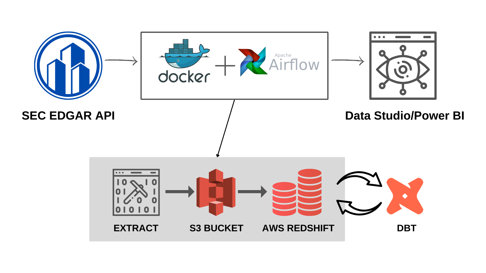

# SEC Data Dashboard Project

## Overview

The Stock SEC Data Dashboard project is designed not only to create a dashboard but also to serve as a learning experience, introducing users to a range of tools, helping them develop new skills, and potentially assisting others in similar data-related endeavors. This versatile tool can be adapted to work with various forms of data, such as interactions on social networks, financial trading data, common crawl data, and more.

## Project Workflow

The project workflow is divided into several key steps:

1. **AWS Infrastructure Setup**: This step involves configuring Amazon Web Services (AWS) resources, including Amazon S3 for object storage and Amazon Redshift for data warehousing. We use Terraform for infrastructure-as-code to quickly set up these resources.

2. **Configuration**: A configuration file (`configuration.conf`) is created to store project-specific details like AWS credentials, Redshift connection information, and other configurations required for data extraction and loading.

3. **Docker & Airflow Setup**: Apache Airflow is used to orchestrate the pipeline. Docker is employed to create and manage containers, simplifying the setup process. This step ensures that the necessary containers and services are running to facilitate data extraction, transformation, and loading.

4. **Data Extraction and Loading**: Within the Airflow environment, a DAG (Directed Acyclic Graph) named `sec_data_pipeline` is defined. This DAG automates the extraction of data from SEC, uploading it to an S3 bucket, and loading it into Amazon Redshift. Tasks in this DAG utilize the `BashOperator` to run Python scripts for data processing.

5. **Data Transformation with dbt (Optional)**: This optional step involves using dbt to connect to the data warehouse and perform data transformations. While not a core part of the project, it offers an opportunity to explore dbt and build skills in data transformation.

6. **Visualization with BI Tools (Optional)**: The project also allows for connecting Business Intelligence (BI) tools to the data warehouse to create visualizations. Google Data Studio is recommended, but users are free to choose other BI tools based on their preferences and requirements.

## Getting Started

To begin using the Stock SEC Data Dashboard project, follow these steps:

For more detailed steps visit the [project starter](documents/starter.md)

1. **AWS Setup**: Create a personal AWS account if you don't already have one. Secure your account by enabling multi-factor authentication (MFA) and set up an IAM user for admin permissions. Configure AWS CLI with your credentials.

2. **Infrastructure Setup**: Use Terraform to set up AWS resources for S3, Redshift, and related components. Customize the configuration in `variables.tf` to match your project requirements.

3. **Configuration**: Create a `configuration.conf` file in the `airflow/pipeline` directory to store project-specific details such as AWS configurations, Redshift credentials, and bucket names.

4. **Docker & Airflow Setup**: Install Docker and Docker Compose on your machine. Initialize the Airflow environment using Docker Compose, and ensure that the necessary containers are up and running. Access the Airflow Web Interface at `http://localhost:8080` and monitor the `sec_data_pipeline` DAG.

5. **Data Extraction and Loading**: The `sec_data_pipeline` DAG runs automatically to extract data from sec, upload it to S3, and load it into Redshift. Monitor the DAG's status in the Airflow UI.

6. **Optional Steps**: Explore optional steps such as data transformation with dbt and visualization with BI tools to enhance your project further.

## Project Details

- **Project Structure**: The project's structure includes directories for infrastructure (Terraform), configuration (AWS and Airflow), data extraction (Python scripts), and optional steps like dbt and BI tools integration.

- **Customization**: Feel free to customize the project by modifying configurations, adding new data sources, or integrating additional tools as needed.

## Contributors

- Harshit Sharma

## License

This project is licensed under the [MIT License](LICENSE).